# Stock pattern recognition

## [View model website](https://stockpatternrecognition.streamlit.app/)

## Index

1 - [Overview of the project workflow](#Project-diagram) 
2 - [Detailed explanation of everything about the approach taken](#abstract) 
3 - [Financial information about some candle and pattern types](#financial-information) 

## Project-diagram

## Abstract

Candlestick charts are a visual representation that showcases the highest, lowest, opening, and closing prices within a specific time frame. These charts reveal recurring candlestick patterns as a result of predictable human actions and reactions. These patterns encode valuable information within the candlesticks, that traders employ to make informed decisions about when to enter or exit the market.

To simplify the process of pattern recognition, we propose a dual-model system that automatically identifies chart patterns and candlestick types with a library called TA-lib. The pattern recognition model employs 2 models using Conv1D and LSTM technology with two outputs to classify the specific pattern and another one to pinpoint the dates on which these patterns occurred. The pattern recognition gives a 79.8% accuracy, and the dates model has 13.4 mae on the test set. This metrics come from testing it with the data that we have, but it is to be noted that we are not financial experts by any means, and the model is as good as the data it was trained on...

We called the model proposed the popping model, which enables us to get up to 5 chart patterns in one time series. More on this on the [Final approach](#our-final-approach) part

### Introduction

LSTMs are predominantly employed in the domain of extensive language processing. However, it is important to note that, fundamentally, a tokenized sentence is essentially a delimited collection of individual elements, with each element corresponding to a lexical unit, namely a word. In essence, a sentence constitutes an ordered succession of these lexical units, while a stock timeseries represents a chronological progression of financial data points encapsulated as candlesticks. In light of this analogy, one may contemplate the conceptual assimilation of each candlestick as akin to a linguistic token within a sentence. This perspective facilitates the utilization of LSTM-based analytical methodologies for the examination of time series data.

### Data extraction

Retrieving the data posed a significant challenge due to the limited availability of extensive databases containing examples of chart patterns. Our research led us to utilize the atmatix.pl website, which emerged as the most suitable resource. This particular website furnished comprehensive information pertaining to tickers, commencement, and culmination points for every observed chart pattern spanning multiple years. Subsequently, armed with this valuable data, we compiled the stock information in CSV format.

Recognizing that the quantity of real-world examples at our disposal fell short of our research needs, we embarked on the development of a synthetic data generator. For each observation, the selected chart pattern was positioned at the center, accompanied by the introduction of noise via the following equation: "ar1 * y1 + ar2 * y0 + scipy.stats.norm.rvs(mu, sigma)," applied to both sides of the pattern. The pattern's definition adhered to logical parameters while incorporating a degree of random variability, thus generating a diverse array of observations for each pattern and mitigating the risk of overfitting.

### Inbalanced dataset

The main problem arised when counting the number of observations we had for each pattern. For the 4 main patterns we had roughly 1500 observations and for the next 4 we had 300. And when training the model the recall was bad because of this inbalance.

The solution was doing data augmentation. Doing image croping giving random values from 0 to 2/3 of the width of the pattern to each side so that every crop of the same observation is different, and doing that 10 times for every observations of the unbalanced dataset.

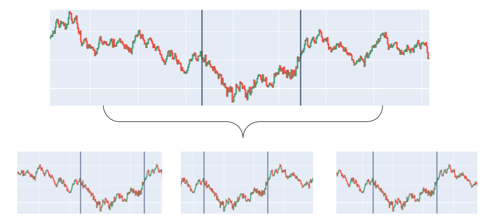

Furthermore, we leveraged the inherent symmetry within each pattern category, wherein each pattern had its corresponding "mirrored" counterpart. For instance, the rising wedge was paired with the falling wedge, the double bottom with the double top, and so forth. Consequently, we inverted each pattern and allocated them the same count as their respective mirrored patterns.

### Approaches considered

#### 1st: Turning timeseries into GAF

This idea was taken from Chen, JH., Tsai, YC. Encoding candlesticks as images for pattern classification using convolutional neural networks. Financ Innov 6, 26 (2020). https://doi.org/10.1186/s40854-020-00187-0

In this research paper they discuss the approach of converting for each time series the open, high, low and close to Gramian-Angular-Fields, and then training a Conv2d model. They report having a 90% accuracy which is much better than the LSTMs one.

We decided not to use this approach because at one point we had up to 30000 timeseries, because of augmenting all the input data, and converting timeseries to GAFs was not as quick as you may think with the limited resources and time that we had to finish the project. Also our max length of a timeseries was 450 candles, but the average length was 115, so the padding covered most of the image in some timeseries pottentialy affecting the model

#### 2nd: Different structures with LSTMs

Initially, we considered eight separate models, each for a specific pattern or no pattern detection. However, they only achieved slightly better accuracy than a 50% baseline due to limited data.

To address this, we designed a single model using the functional API to handle both classification and regression tasks simultaneously. This approach struggled because the regression task had a much larger loss, making the model prioritize date prediction over pattern identification. Attempting to balance this with the loss weighting parameter didn't yield satisfactory results.

#### 3rd: Using windows

We explored the possibility of merging the models using a rolling window approach of varying lengths to detect multiple patterns within a single time series. The window lengths considered were 15%, 30%, 45%, 60%, and 75% of the time series length.

To enhance the model's pattern classification, we employed one-hot encoding for pattern types, allowing us to gauge the confidence level with which the model made predictions. The expectation was that the model would identify the most confidently predicted pattern as the prevailing one in the graphs. However, this approach led to a notable 25% reduction in the model's accuracy.

### Our final approach

We decided to make 2 models, one for regression and another for classification. And combined them with something we called the popping model. What this does is first look at the hole timeseries to identify a pattern, once it identifies a pattern it splits the timeseries into 2, one from 0 to the start of the pattern and the other from the end of the pattern to the end of the time series; or in the case it decides that there is no pattern it splits the timeseries in half. And then does the same thing in those two timeseries, and it continious doing so until all of the timeseries lengths are below a threshold (we decided 10%)

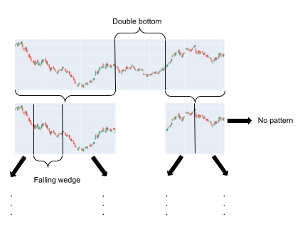

#### The classification model and regression model

The main structure of the models was the same, as it was what better worked for both of them. We used two conv1d layers, 2 lstms and 2 dense layers with 16 neurons in the first and 32 in the second of each couple

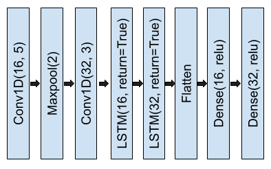

Following this main structure we made two targets, one being an intermediate target that with the concatenate affects the final target. This intermediate target was the same for both models, which was a classification task of 5 outputs that defined if the pattern was from one of the 4 families of patterns (rising wedge and ascending triangle, falling wedge and descending triangle, double top and head and shoulders, double bottom and inverse head and shoulders) or if it had no pattern. We did it this way because of the similarities some patterns had with each other to be able to train the model with more data for every class and improve accuracy.

In the classification model the final target was a binary classification deciding which pattern was between the 2 of the family. And in the regression model the final target was 2 output regression model to find the start and the end date

### Project files explained

* data folder --> Here is all the real data obtained through the web scraping process

* app.py & pages folder --> Streamlit front end

* get_data.py --> Get the real data, creates synthetic data, combines both data and augmentates all data.

* synthetic_data_generator.py --> Creates synthetic data based on basic mathematic functions

* preprocessing.py --> Preprocessing used for yfinance data and training data is detailed

* candle_types_detector.py --> Given a dataframe with the stock market data it creates a boolean column for each candle type that shows if that specific candle has that column's type

* popping_model_logic.py --> All the heavy backend logic that allows to detect multiple models per timeframe, and also the logic that contains the plotting logic

## Financial-information

### Candlesticks Explained

### Single Candlesticks

#### Doji

**Characterised by:** the opening and closing price being the same.

**Signifies:** indecision in the market. If it occurs in and uptrend or a downtrend, it means the trend is likely to reverse.

**Logic:** 20 * ABS(O - C) <= H - L

#### Dragonfly Doji

**Characterised by:** the same open, close and high price during the trading window. It is the bullish version of the Gravestone Doji.

**Signifies:** resistance of buyers and their attempts to push the market up.

**Logic:** 50 * ABS(O - C) <= H - L AND STOC1 >= 70 AND H - L >= AVGH10 - AVGL10 AND L = MINL10

#### Gravestone Doji

**Characterised by: ** very similar opening, closing, and low prices during the tradin window.

**Signifies:** The long upper shadow is an indication that the market is testing a powerful supply or resistance area.

**Logic:** 100 * ABS(O - C) <= H - L AND STOC1 <= 5 AND H > L AND 10 * L <= 3 * H1 + 7 * L1 AND H - L >= AVGH10-AVGL10

#### Hammer

**Characterised by:** a short body, and long lower shadows.

**Signifies:** That sellers were unsuccessful in their attempt to push the price lower. When at the bottom of a downtrend, it signifies a reversal.

**Logic:** 5 * ABS(C - O) <= H - L AND 10 * ABS(O - C) >= H - L AND 2 * O >= H + L AND STOC1 >= 50 AND (20 * O >= 19 * H + L OR STOC1 >= 95) AND 10 * (H - L) >= 8 * (AVGH10 - AVGL10) AND L = MINL5 AND H > L

#### Spinning Top / Bottom

**Characterised by:** a short body, but with shadows that are at least twice the size of the body.

**Signifies:** That both buyers and sellers tried to push the price, but that it closed close to the opening price.

**Logic:** ABS(C - O) / (H - L) < BodyThreshold AND MAX(O, C) - L > ShadowThreshold AND H - MIN(O, C) > ShadowThreshold

#### Marubozo

**Characterised by:** a body with no high or low shadows.

**Signifies:** An extremely strong buying or selling pressure in the previous trading period.

**Logic:** H - L = ABS(O - C) AND H - L > 3 * AVG(ABS(O - C), 15) / 2

##### Opening Marubozu

**Characterised by:** the opening price occurring at the high or low of the trading window.

**Signifies:** That as soon as the bell rang, the bears or the bulls took charge and pushed the prices in the direction for the rest of the window.

**Logic:** (L = O OR O = H) AND H - L > ABS(O - C) AND ABS(O - C) > 3 * AVG(ABS(O - C), 15) / 2

#### Closing Marubozu

**Characterised by:** the closing price being either the high or the low for the trading window.

**Signifies:** That not only did the prices maintain the move in a single direction after initial jitters, in fact the participants maintained the sentiments until the end moment of the trading window.

**Logic:** (L = C OR C = H) AND H - L > ABS(O - C) AND ABS(O - C) > 3 * AVG(ABS(O - C), 15) / 2

### Double Candlesticks

#### Bearish Engulfing Bar Pattern
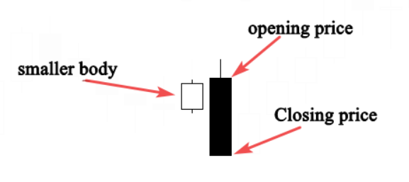
**Characterised by:** two candlesticks, where the second candlestick's body engulfs the previous one.

**Signifies:** That sellers are in control of the market. When it occurs at the end of an uptrend, it indicates buyers are engulfed by sellers which signals a trend reversal.

**Logic:** O1 > C1 AND 10 * (C - O) >= 7 * (H - L) AND C > O1 AND  C1 > O AND 10 * (H - L) >= 12 * (AVGH10 - AVGL10)

#### Bullish Engulfing Bar Pattern

**Characterised by:** two candlesticks, where the second candlestick's body engulfs the previous one.

**Signifies:** That the  sellers are no longer in control of the market, and buyers will take control. When it occurs at the end of a downtrend, the reversal is more powerful as it represents a capitulation bottom.

**Logic:** O1 > C1 AND 10 * (C - O) >= 7 * (H - L) AND C > O1 AND  C1 > O AND 10 * (H - L) >= 12 * (AVGH10 - AVGL10)

#### Harami Pattern
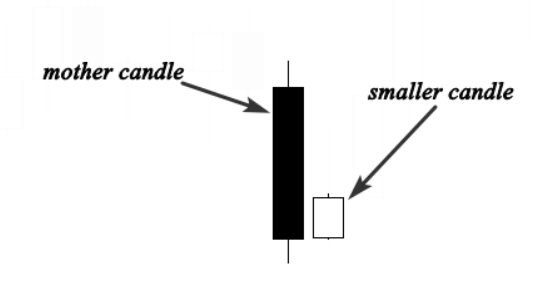
**Characterised by:** A large first candle (the mother) followed by a smaller second candle (the baby). The second candle should close outside the previous one.

**Signifies:** TBuyers and sellers don't know what to do, and there is no one in control od the market. The market is consolidating. It is considered a bearish reversal signal when it occurs at the top of an uptrend, and a bullish signal when it occurs at the bottom of a downtrend.

**Logic:** 10 * (O1 - C1) >= 7 * (H1 - L1) AND H1 - L1 >= AVGH10.1 - AVGL10.1 AND C > O AND O > C1 AND O1 > C AND 6 * (O1 - C1) >= 10 * (C - O)

#### Tweezer Bottom Pattern
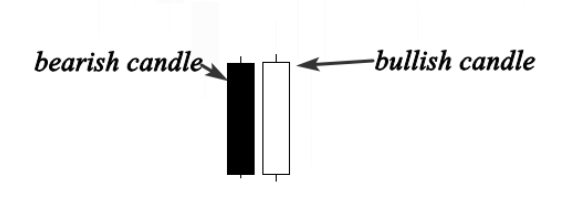
**Characterised by:** A bearish candlestick followed by a bullish candle.

**Signifies:** The Tweezer Bottom happens during a downtrend, when sellers push the market lower, but the next session the price closes above or roughly at the same price od the first bearish candle, which indicates that buyers are coming to reverse the market direction. This is a bullish reversal pattern seen at the bottom of a downtrend.

**Logic:** L = L1 AND 5 * ABS(C - O) < ABS(C1 - O1) AND 10 * ABS(C1 - O1) >= 9 * (H1 - L1) AND 10 * (H1 - L1) >= 13 * (AVGH20 - AVGL20)

#### Tweezer Top Pattern

**Characterised by:** A bullish candlestick followed by a bearish candle.

**Signifies:** The tweezers top occurs during an uptrend when buyers push the price higher, but sellers surprised buyers by pushing the market lower and close down the open of the bullish candle.

If this price action happens near a support level, it indicates that a bearish reversal is likely to happen.

**Logic:** H = H1 AND ABS(C - O) < .2 * ABS(C1 - O1) AND ABS(C1 - O1) >= .9 * (H1 - L1) AND H1 - L1 >= 1.3 * (AVGH20 - AVGL20)

### Triple Candlesticks

#### Morning Star Pattern

**Characterised by:** A first bearish candlestick, a second smaller candle which can be bullish or bearish, and a third, bullish candle that closes above the midpoint of the body of the first trading window.

**Signifies:** The first candle indicates sellers are still in charge of the market.
The second candle represents that sellers are in control, but they don't push the market much lower.
The third candle holds a significant trend reversal.

Together, it shows how buyers took control of the market from sellers.

When this pattern occurs at the bottom of a downtrend near the support level, it is interpreted as a powerful trend reversal signal.

**Logic:** O2 > C2 AND 5 * (O2 - C2) > 3 * (H2 - L2) AND C2 > O1 AND 2 * ABS(O1 - C1) < ABS(O2 - C2) AND H1 - L1 > 3 * (C1 - O1) AND C > O AND O > O1 AND O > C1

#### Evening Star Pattern
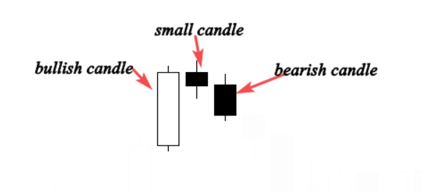
**Characterised by:** A first, bullish candle.
This is followed by a small candle which can be bullish, bearish, Doji, or any other.
The third candle is a large, bearish candle.

**Signifies:** The first candle indicates that bulls are still pushing the market higher.
The second candle shows that buyers are in control, but they are not as powerful as they were.
The third candle shows that the buyer's domination is over, and a possible bearish trend reversal is likely.

**Logic:** C2 - O2 >= .7 * (H2 - L2) AND H2 - L2 >= AVGH10.2 - AVGL10.2 AND C1 > C2 AND  O1 > C2 AND H - L >= AVGH10 - AVGL10 AND O - C >= .7 * (H - L) AND O < O1 AND O < C1

#### Three Inside Up Pattern

**Characterised by:** Composed by a large down candle, a smaller up candle contained with the previous candle, and then a third candle that closes above the close of the second candle.

**Signifies:** A bullish reversal pattern.

**Logic:** 10 * (O2 - C2) >= 7 * (H2 - L2) AND (H2 - L2) >= AVGH10.2 - AVGL10.2 AND C1 > O1 AND O1 > C2 AND C1 < O2 AND 5 * (C1 - O1) <= 3 * (O2 - C2) AND O > O1 AND O < C1 AND C > C1 AND 10 * (C - O) >= 7 * (H - L)

#### Three Inside Down Pattern

**Characterised by:** Composed by a large up candle, a smaller down candle contained with the previous candle, and then a third down candle that closes below the close of the second candle.

**Signifies:** A bearish reversal pattern.

**Logic:** ABS(C2 - O2) > .5 * (H1 - L1) AND C2 > O2 AND C1 < O1 AND H1 < C2 AND L1 > O2 AND C < O AND C < C1

#### Three Black Crows

**Characterised by:** Three consecutive bearish candles at the end of a bullish trend.

**Signifies:** A shift in control from the bulls to the bears.

**Logic:** O1 < O2 AND O1 > C2 AND O < O1 AND O > C1 AND C1 < L2 AND C < L1 AND C2 < 1.05 * L2 AND C1 < 1.05 * L1 AND C < 1.05 * L

#### Three White Soldiers

**Characterised by:** Three consecutive long-bodied candlesticks that open within the precious cansle's real body and a close that exceeds the previous candle's high.

**Signifies:** A shift in control from the bulls to the bears.

**Logic:** C > C1 AND C1 > C2 AND C > O AND C1 > O1 AND C2 > O2 AND 2 * ABS(C2 - O2) > H2 - L2 AND 2 * ABS(C1 - O1) > H1 - L1 AND H - L > AVGH21 - AVGL21 AND O > O1 AND O < C1 AND O1 > O2 AND O1 < C2 AND O2 > O3 AND O2 < C3 AND 20 * C > 17 * H AND 20 * C1 > 17 * H1 AND 20 * C2 > 17 * H2

### Other Candlestick Patterns

#### Bearish / Bullish Breakaway

**Characterised by:** A first, long candle.
A second, third and fourth candle which must be spinning tops.
A fifth candle must be a long candle which closes within the body gap of the first two candles.

**Signifies:** A reversal in the trend.

**Bearish Logic:** ABS(C4 - O4) > .5 * (H4 - L4) AND C4 > O4 AND C3 > O3 AND L3 > H4 AND C2 > C3 AND C1 > C2 AND C < O AND L < H4 AND H > L3

**Bullish Logic:** C4 < O4 AND 2 * ABS(C4 - O4) > H4 - L4 AND C3 < O3 AND H3 < L4 AND C2 < C3 AND C1 < C2 AND 5 * ABS(C - O) > 3 * (H - L) AND C > O AND C > H3

### Chart Patterns

#### Bearish/Bullish flag
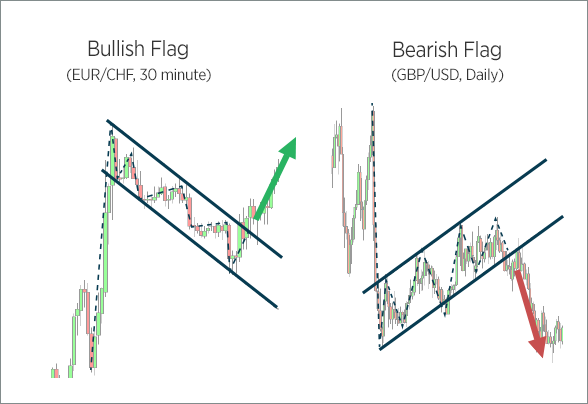
**Characterised by:** Consists of the flagpole and a flag. As such, it resembles a flag on a pole. It's constituted after the price action trades in a continuous uptrend, making the higher highs and higher lows in the bulish one and the reverse in the bearish pattern

**Signifies:**  The flag pattern is used to identify the possible continuation of a previous trend from a point at which price has drifted against that same trend. Should the trend resume, the price increase could be rapid, making the timing of a trade advantageous by noticing the flag pattern.

#### Bearish/Bullish Pennant
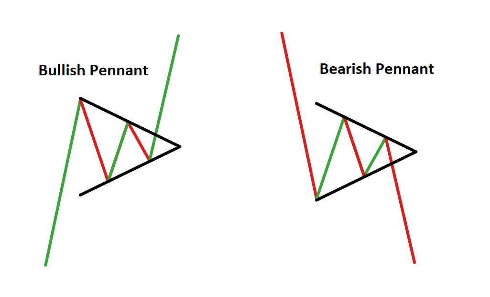
**Characterised by:** A pennant is a type of continuation pattern formed when there is a large movement in a security, known as the flagpole, followed by a consolidation period with converging trend lines—the pennant—

**Signifies:**  It represents the second half of the flagpole as a continuation of the trend that it had before the consolidation of the price

#### Ascending/descending triangle
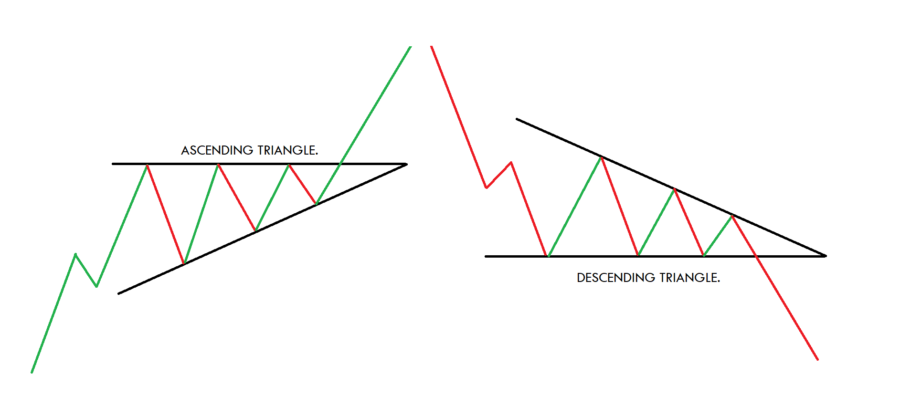
**Characterised by:**  It is created by price moves that allow for a horizontal line to be drawn along the swing highs and a rising trendline to be drawn along the swing lows. The two lines form a triangle. And the reverse happens in the descending

**Signifies:** This are called continuation patterns since price will typically break out in the same direction as the trend that was in place just prior to the triangle forming.

#### Cup with handle
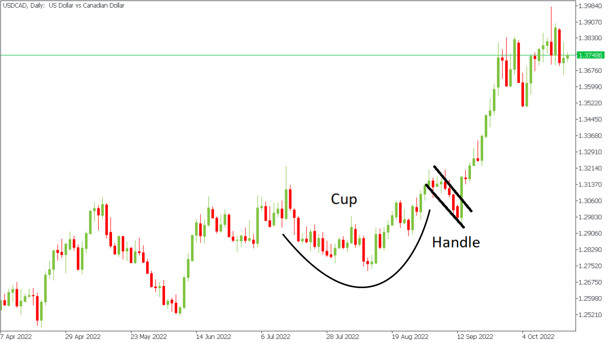
**Characterised by:** Is a technical indicator that resembles a cup with a handle, where the cup is in the shape of a "u" and the handle has a slight downward drift.

**Signifies:** The cup and handle is considered a bullish signal, with the right-hand side of the pattern typically experiencing lower trading volume.

#### Double top/bottom
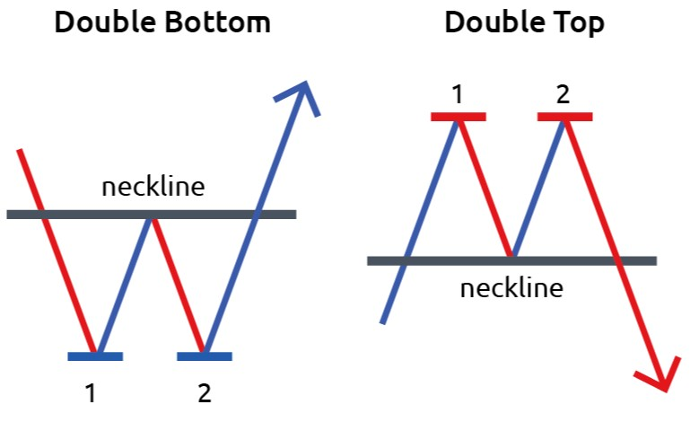
**Characterised by:** They occur when the underlying investment moves in a similar pattern to the letter "W" (double bottom) or "M" (double top).

**Signifies:** A double top indicates a bearish reversal in trend. A double bottom is a signal for a bullish price movement.

#### Head and shoudlers
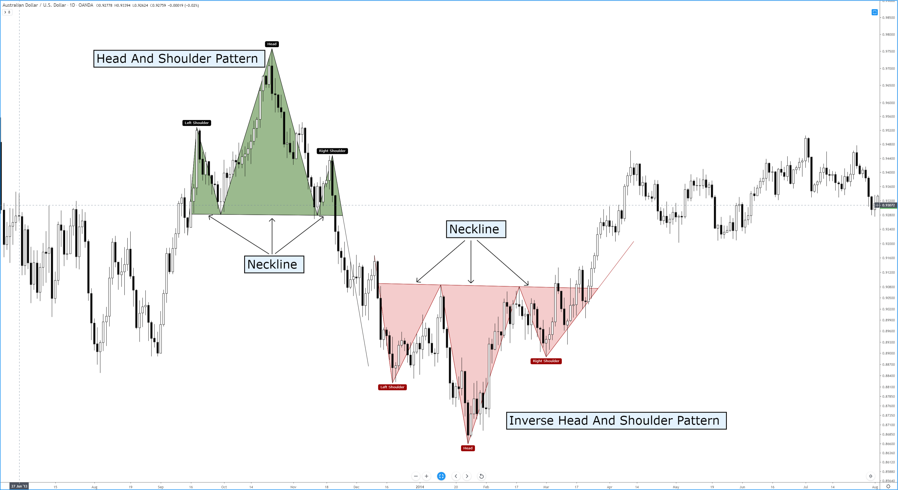
**Characterised by:** The pattern appears as a baseline with three peaks, where the outside two are close in height, and the middle is highest.

**Signifies:** It is a specific chart formation that predicts a trend reversal.

#### Falling and rising wedge
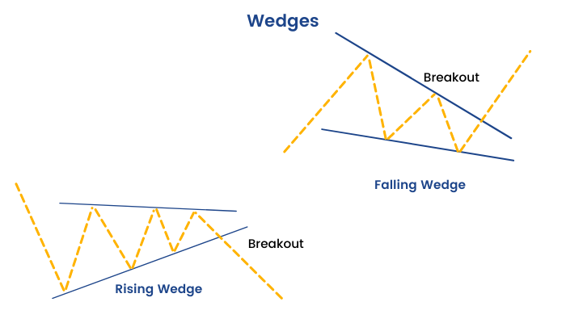
**Characterised by:** Is marked by converging trend lines on a price chart. The two trend lines are drawn to connect the respective highs and lows that are either rising or falling at differing rates, giving the appearance of a wedge.

**Signifies:** Wedge shaped trend lines are considered useful indicators of a potential reversal in price action by technical analysts.

#### Triple top/bottom

**Characterised by:** A triple top is formed by three peaks moving into the same area, with pullbacks in between, while a triple bottom consists of three troughs with rallies in the middle.

**Signifies:** While not often observed, triple tops and bottoms provide compelling signal for trend reversals.
